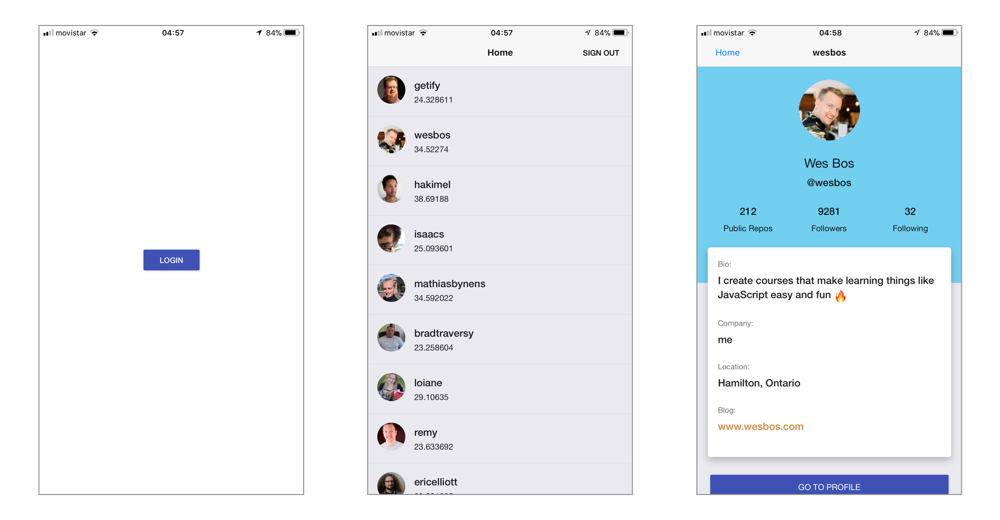

# React Native Workshop - ReactJSAcademy

## Setup

```
git clone <REPO>
cd react-native-workshop
yarn install
# or
npm install
```

## Run your project

There are Two major ways to run yout Expo projects locally: using EXP, or running it in your Simulator (Xcode or Android Studio, Genymotion...). I recommend installing exp in your cli and login into your account in order to run your project directly into your phone.

### Using EXP

- `npm install exp --global`. You can also install de desktop app (https://github.com/expo/xde)
- `exp login` to login with your account (signup into expo.io required)
- install the Expo client in your phone (and login)
- in the repo directory: `exp start --lan`

This will start the Bundler for the app and enables the app for visualization at your phone. Now you only need to go to your phone to the `Projects` tab and Voila!, there it is!!

Happy Coding!

## Excersice

The Goal of this Excersice is to Introduce you to React Native development, helping you familiarize with its APIs and basic structure.

We are going to build a simple app with **three screens** as you can see below



All the instructions are in the corresponding files, here are the headlines of what you have to do:

### src/index.js`

1.  Create a Stack Navigator (MainNavigator) with two screens: Home & Profile
2.  Create a Switch Navigator (Navigator)with two screens: Auth & the MainNavigator
3.  the App component should return the entryPoint of our app.

### src/screens/AuthScreen.js

4.  Set the title for this navigation view (add whatever you want)
5.  implement the `login()` method. Navigate to the `HOME_SCREEN`

### src/screens/HomeScreen.js

6.  Create a `FlatList` and show all the users from the API
7.  Finish the implementation of the handlePress of the `UserLItem`. Hint: you need to pass a parameter to the next screen

### src/screens/ProfileScreen.js

8.  Read the Parameter sent from the previous Screen
9.  Build the Layout for the Profile Page
10. add a Button at the end of the Profile to open the users Github profile on the Browser (HINT: check the usage for `Linking` in React Native)

### Bonus Excersices

For this its best to checkout the solution branch, because you will need a file that is in there :)

- add a Logo `AuthScreen.js` on top of the Button
- implement InfiniteScroll in HomeScreen with the `NextUrl`
- create an Abstract Component for the Button, and replace them through all the app
- add the `LoadingScreen` to the Switch Navigator as the initial Route
- read the documentation for `react-native-authentication-helpers` and try to implement it.
  - HINT: you can simply `setUser({ type: 'anonymous'})` for the porpuse of the Excersice.
- when `logout`, clean the User and send it to `AUTH_SCREEN`

## Resources

- https://facebook.github.io/react-native/
- https://docs.expo.io/versions/latest/
- https://reactnavigation.org/docs/en/getting-started.html
- https://callstack.github.io/react-native-paper/
- https://react-native-training.github.io/react-native-elements/
- https://nativebase.io/
- https://native.directory/

## Who to follow:

- https://twitter.com/reactnative
- https://twitter.com/reactiflux
- https://twitter.com/greweb
- https://twitter.com/ReactEurope
- https://twitter.com/react_native_eu
- https://twitter.com/ReactAlicante
- https://twitter.com/R_N_Radio
- https://twitter.com/Baconbrix
- https://twitter.com/dabit3
- https://twitter.com/kurtiskemple
- https://twitter.com/expo
- https://twitter.com/grabbou
- https://twitter.com/notbrent
- https://twitter.com/ferrannp
- https://twitter.com/infinite_red
- https://twitter.com/ChainReactConf
- https://twitter.com/VladimirNovick
