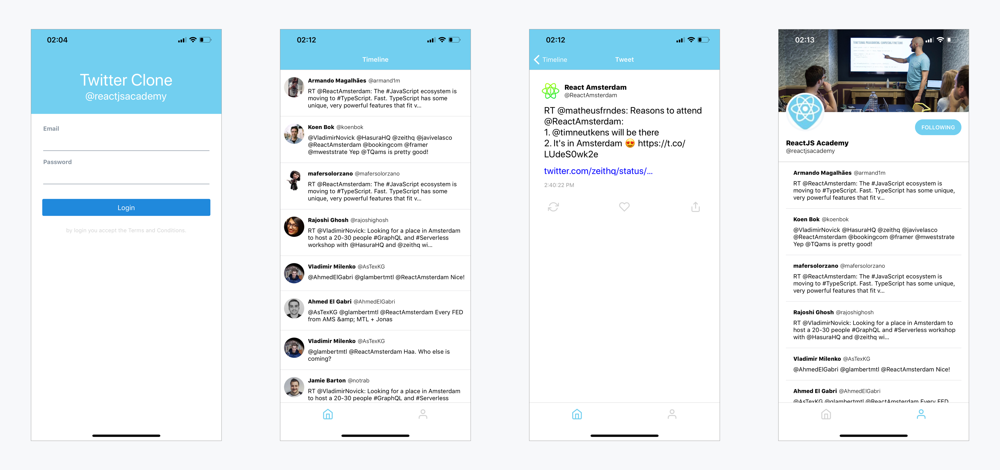
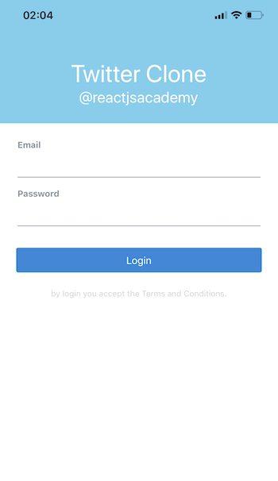

# React Native Training - ReactJSAcademy



You can check out the individual original screenshots [here](./originals)

## Setup

```
git clone <REPO>
cd react-native-workshop
yarn install
# or
npm install
```

## Run your project

There are Two major ways to run yout Expo projects locally: using EXPO CLI, or running it in your Simulator (Xcode or Android Studio, Genymotion...). I recommend installing exp in your cli and login into your account in order to run your project directly into your phone.

### using Expo CLI

```bash
yarn add global expo-cli
# or

npm i -g expo-cli
expo init MY_PROJECT_NAME
cd MY_PROJECT_NAME
expo start
```

This will start the Bundler for the app and enables the app for visualization at your phone. Now you only need to go to your phone to the `Projects` tab and Voila!, there it is!!

Happy Coding!

## Exercise

### Foundation

#### Part 1

We are going to start by creating the Login screen. Go to [Expo Snack](https://snack.expo.io) and create the following Screen from Scratch:



[You can download a bigger image for the Login screen here](./originals/login.PNG)

You can use the following components:

- `import { TextInput } from 'react-native-paper';`
- `import { Button } from 'react-native-paper';`

Note react-native-paper is already included by default in Snack

#### Bonus exercise

Create your custom TextInput and Button

#### Part 2

To get started

```
 git clone https://github.com/reactjsacademy/react-native-training.git
 git checkout foundation
 cd react-native-training
 npm install
```

Tasks:

- [ ] 1. (Optional) Paste your LoginScreen from the part 1 Snack into `src/Screens/LoginScreen.js`
- [ ] 2. Change the root component of the application from LoginScreen to TOCScreen. To do this change the default export in App.js.
- [ ] 3. There is a bug in `src/Screens/TOCScreen.js`, it can't display all the content. You need to change the View so it has scroll.
- [ ] 4. Nice! we've got our first view with a scroll. Next it's going to use a more performant scroll for long lists. First, change the root component of the application from TOCScreen to TimelineScreens.
- [ ] 5. Go to `src/Screens/TimelineScreens` and implement a FlatList for the data that is fetched. There are some comments with hints. If you need some help, raise your hand :)

#### Bonus exercise

Add likes and retweets to each tweet in the FlatList. You can use the following icons [https://docs.expo.io/versions/latest/guides/icons/](https://docs.expo.io/versions/latest/guides/icons/)

### Navigation

#### Exercise 1

1.  Create a Stack Navigator in `src/Screens/PublicNavigator.js` that shows the LoginScreen & the Terms and Conditions screen. Tips:
    - You can read the official doc here [https://reactnavigation.org/docs/en/stack-navigator.html](https://reactnavigation.org/docs/en/stack-navigator.html)
    - You can use the above LOGIN_SCREEN and TOC_SCREEN as route names
2.  Add some options to the navigator

    - headerMode: none
    - mode: 'modal'
    - initialRouteName: LOGIN_SCREEN (optional)

3.  Update the entry point of the app with `createAppContainer` using the PublicNavigator in `src/Screens/RootNavigator.js`.

_Hints:_

- In `src/Screens/PublicNavigator.js` you can use the constants LOGIN_SCREEN and TOC_SCREEN defined in the PublicNavigator.js to name your screens to maintain consistency when navigating.
- [https://reactnavigation.org/docs/en/stack-navigator.html#modal-stacknavigator-with-custom-screen-transitions](https://reactnavigation.org/docs/en/stack-navigator.html#modal-stacknavigator-with-custom-screen-transitions)

#### Exercise 2

In `src/Screens/RootNavigator` create a Switch Navigator called `MainNavigator` with a PRIVATE and a PUBLIC view (check the imports!). You need to update the entry point of your app in `createAppContainer`.

#### Exercise 3

1. In `src/Screens/TimelineNavigator.js` create a stack Navigator ([https://reactnavigation.org/docs/en/stack-navigator.html](https://reactnavigation.org/docs/en/stack-navigator.html)) for the TimeLine using the following screens:

```js
  [TIMELINE_FEED_SCREEN]: TimelineScreen,
  [TWEET_DETAIL_SCREEN]: TweetDetailScreen,
  [USER_PROFILE]: ProfileScreen,

```

2. Let's style our Navigator! We need to pass an extra parameter to change the configuration as follows.
   2.1. The header backgroundColor for this navigator should be `Colors.brand.primary`. Hint use the `headerStyle` in `defaultNavigationOptions` [https://reactnavigation.org/docs/en/stack-navigator.html#stacknavigatorconfig](https://reactnavigation.org/docs/en/stack-navigator.html#stacknavigatorconfig)
   2.2. The [headerTintColor](https://reactnavigation.org/docs/en/stack-navigator.html#headertintcolor) should be `Colors.light` (check the imports for the colors in `src/Screens/TimelineNavigator.js`).

#### Exercise 4

1. in `src/Screens/TimelineScreen.js`:
   1.1. the header title for this view should be `Timeline`
   1.2. Implement the `handleTweetPress` method to send the user to the `TWEET_DETAIL_SCREEN` screen,
   passing the `id` as a parameter. Hint:
   [https://reactnavigation.org/docs/en/navigation-prop.html#navigate-link-to-other-screens](https://reactnavigation.org/docs/en/navigation-prop.html#navigate-link-to-other-screens)

2. in `src/Screens/TweetDetailScreen.js`
   2.1. Set the header title for this view should be `Tweet`
   2.2. Implement the `handleProfilePress` method to send the user to the `USER_PROFILE` screen,
   passing the parameters below:

```js
  {
    userId: this.state.tweet.user.id_str,
    name: this.state.tweet.user.screen_name
  }
```

Hint: [https://reactnavigation.org/docs/en/navigation-prop.html#navigate-link-to-other-screens](https://reactnavigation.org/docs/en/navigation-prop.html#navigate-link-to-other-screens)

#### Bonus exercise `src/Screens/PrivateNavigator.js`

1. Create a BottomTabNavigator and use it as `PrivateNavigator` for yout app:

- This will be an extra layer on your app. the entry point for you Private Section.
- You can use the already created `PrivateNavigator` file to start with.
- Define getTabBarIcon and use if to assign Icons to both Views
- The two tabs should be the `MAIN_TIMELINE_SCREEN` that loads the already created `TimelineNavigator`, and the `MY_PROFILE` route that will render the `ProfileScreen` with the "user's data".
- `ProfileScreen` expects some paramenters in order to load the user's data. you need when the user "presses"
  the tab, you need to pass the correct parameters from the current logged user (now hardcoded). Hint: [https://reactnavigation.org/docs/en/bottom-tab-navigator.html#tabbaronpress](https://reactnavigation.org/docs/en/bottom-tab-navigator.html#tabbaronpress)
- you have a utility function defined to get the icon for the tabs that you need to finish implementing and using it.

Hint: [https://reactnavigation.org/docs/en/tab-based-navigation.html#customizing-the-appearance](https://reactnavigation.org/docs/en/tab-based-navigation.html#customizing-the-appearance)

### Animations

#### Part 1

Go to `src/Screens/AnimationExample.js` and do the following tasks:

- Task 1, animate the View so it moves on the Y axis 200 units
- Task 2, animate the background colour of the View so it goes from red to green using the rgba(0,0,0,1) format. Hint, you need to interpolate the animated value.
- Task 3, animate the View as follows:
  - It moves on the Y axis twice what it does on the X axis.
  - The View should change the background color from green to blue
  - The opacity of the View should go from 0 to 1
  - The duration for all the animations should be 2 seconds.

#### Part 2

Final exercise, let's create the Twitter user profile on scroll animation and use all the animations we've learned 🎉

Go to `src/Screens/RootNavigator.js` and replace `export const RootNavigator = AnimationExample;` with `export const RootNavigator = createAppContainer(MainNavigator);`

- Task 1, Replace the `scrollY = 1;` at the top of the ProfileScreen class with an animated value (initial value 1)
- Task 2. Add an [Animated.event](https://facebook.github.io/react-native/docs/animated#handling-gestures-and-other-events) for the on scroll event in the ScrollView
- Task 3, animate the cover image adding the following opacity:
  - When the scroll is 0 then the opacity is 1
  - When the scroll is 125 then the opacity is 0
- Task 4, animate the View that wrapps the TopBar component so it has the following opacity:
  - When the scroll is 0 then the opacity is 0
  - When the scroll is 100 then the opacity is 0.1
  - When the scroll is 125 then the opacity is 1
- Task 5, animate the Avatar size so when the user scrolls the Avatar becomes smaller
- Task 6, use [useNativeDriver:true](https://facebook.github.io/react-native/docs/animated#using-the-native-driver) in the configuration of the animation. Hint, if you used the style props width and height on task 5 then you'll need to refactor them to use the prop transform scaleX and scaleY.

#### Bonus

Animate the Avatar so when the user scrolls down and the Avatar gets smaller the center of the Avatar stays in the same position.

## Slide Links

- [Flex Dimensions examples](https://snack.expo.io/@leanjscom/dimensions-example)
- [More info about the flex differences](https://facebook.github.io/react-native/docs/layout-props#flex)
- [Yoga Library](https://github.com/facebook/yoga)
- [Layout props documentation](https://facebook.github.io/react-native/docs/layout-props)
- [ScrollView Example](https://snack.expo.io/@rjsa/scrollview-example)
- Using a ListView: [https://facebook.github.io/react-native/docs/using-a-listview](https://facebook.github.io/react-native/docs/using-a-listview)
- [Handling Touches](https://facebook.github.io/react-native/docs/handling-touches)
- [More examples](https://expo.io/snacks/@rjsa)
- [and more examples](https://expo.io/snacks/@horacio)

## React Native UI Libraries

- [React Native Elements](https://react-native-training.github.io/react-native-elements/)
- [NativeBase](https://nativebase.io/)
- [React Native Paper](https://reactnativepaper.com/)

## React Native Frameworks

- [Expo](https://expo.io)
- [Ignite](https://infinite.red/ignite)

## CI / CD Platforms as a Services

- [Visual Studio App Center](https://appcenter.ms/)
- [Bitrise](https://www.bitrise.io/)

## React Native testing

- [Jest](https://jestjs.io/docs/en/tutorial-react-native)
- [React Native Testing Library](https://callstack.github.io/react-native-testing-library/)
- [Detox](https://github.com/wix/Detox): End-to-End testing

## Resources

- https://facebook.github.io/react-native/
- https://medium.com/leanjs/organizing-a-react-native-project-by-concern-91cc99be4e28
- https://docs.expo.io/versions/latest/
- https://reactnavigation.org/docs/en/getting-started.html
- https://react-native-training.github.io/react-native-elements/
- https://callstack.github.io/react-native-paper/
- https://nativebase.io/
- https://native.directory/

## Who to follow:

- https://twitter.com/reactnative
- https://twitter.com/reactiflux
- https://twitter.com/greweb
- https://twitter.com/ReactEurope
- https://twitter.com/react_native_eu
- https://twitter.com/ReactAlicante
- https://twitter.com/R_N_Radio
- https://twitter.com/Baconbrix
- https://twitter.com/dabit3
- https://twitter.com/kurtiskemple
- https://twitter.com/expo
- https://twitter.com/grabbou
- https://twitter.com/notbrent
- https://twitter.com/ferrannp
- https://twitter.com/infinite_red
- https://twitter.com/ChainReactConf
- https://twitter.com/VladimirNovick
- Twitter API auth process: https://stackoverflow.com/questions/45078952/twitter-api-application-only-authentication
